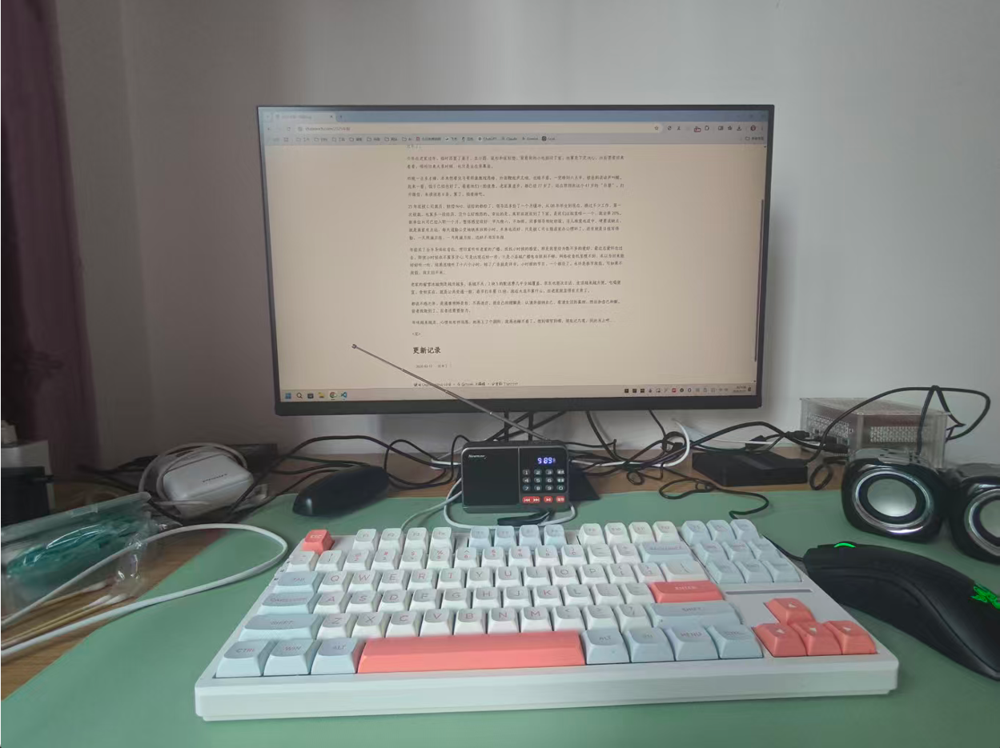

过年了...

今年在老家过年，临时添置了桌子、显示器、鼠标和鼠标垫，背着我的小电脑回了家。也算是下定决心，往后要常回来看看，哪怕回来大多时候，也只是坐在屏幕前。  

昨晚一点多才睡，本来想看完马哥那集教程再睡，外面鞭炮声又响，也睡不着。一觉睡到六点半，被爸妈说话声叫醒。起来一看，饺子已经包好了。看着他们一脸疲惫，老家算虚岁，都已经 77 岁了，还在照顾我这个 41 岁的 “巨婴”。打开微信，未读消息 0 条，算了，接着睡吧。  

25 年底被 C 司裁员，赔偿 N+0，该给的都给了，领导还多给了一个月缓冲。从 08 年毕业到现在，换过不少工作，第一次被裁，也算多一段经历，没什么好抱怨的。幸运的是，离职前就找到了下家，是我们这批里唯一一个，就业率 20%。新单位 H 司已经入职一个月，整体感觉很好：早九晚六，不加班，同事领导相处舒服，活儿难度也适中。硬要说缺点，就是离家有点远，每天通勤公交地铁来回两小时。本来也还好，只是被 C 司长期居家办公惯坏了。还有就是日报写得勤，一天两遍日报，一月两遍月报，还好不用写年报。  

年前买了台半导体收音机，想回家听听老家的广播，找找小时候的感觉。那是我曾经为数不多的爱好，最近总爱怀念过去，即使小时候也不算多开心, 可是比现在好一些。只是小县城广播电台级别不够，网络收音机里搜不到，本以为回来能好好听一听，结果连续听了十六个小时，除了广告就是评书。小时候的节目，一个都没了。也许是春节放假，可如果不放假，我又回不来。  

老家的蜜雪冰城倒是越开越多，县城不大，2 块 5 的配送费几乎全城覆盖。京东也能次日达，生活越来越方便。吃喝便宜，食材实在，就是公共交通一般，春节打车要 15 块，放在大连不算什么，在老家就显得有点贵了。  

都说不惑之年，是遇事明辨是非、不再迷茫。我自己的理解是：认清并接纳自己，看清生活的真相，然后和自己和解。前者我做到了，后者还需要努力。  

年味越来越淡，心情也有些低落。起来上了个厕所，就再也睡不着了。想到哪写到哪，胡乱记几笔，到此为止吧。

<完>
